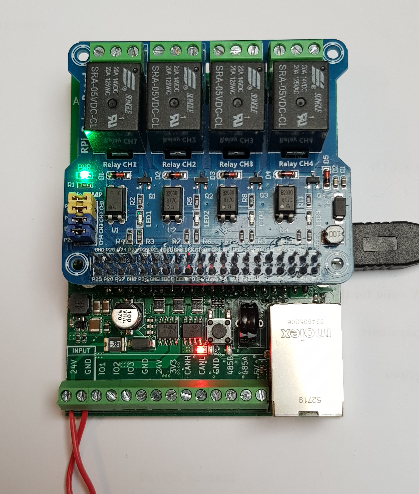
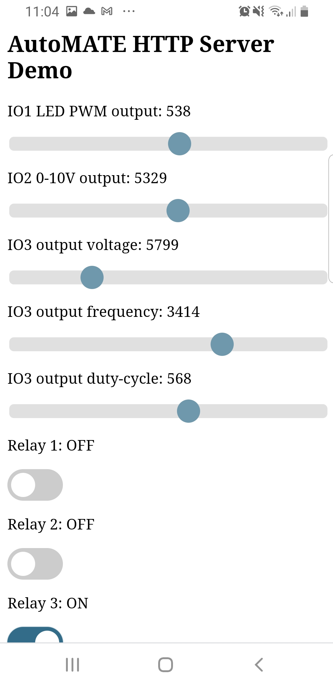
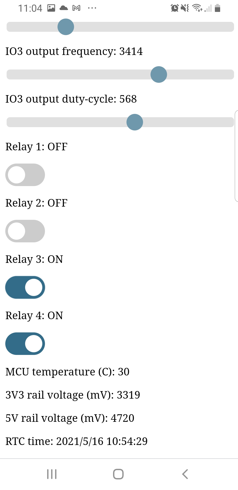

# AutoMATE HTTP Server Demo
Webserver example using Arduino to control IOs and more.

## Demo Features
* Uses HAT GPIOs to control 4 relays
* Uses IO1-IO3 on screw terminal to output analog and digital signals
    * 0-10V output
    * Digital output with adjustable duty-cycle, voltage and frequency
    * PWM output for LEDs
* Reads the RTC time of the STM32
* Monitors the board temperature and voltages
* DMX512 dimming control (on RS485 port)

## Board Setup

## Screenshots
 
